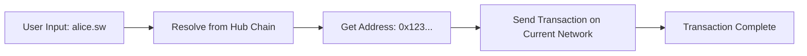

# 🌐 Cross-Chain SmartVerse Architecture

## Overview

SmartVerse menggunakan arsitektur **Hub-Spoke** yang revolusioner untuk memungkinkan penggunaan nama `.sw` di berbagai jaringan blockchain sambil tetap menjaga desentralisasi dan keamanan.

## Architecture Components

### 🏛️ Hub Chain (Sepolia)
- **Peran:** Single Source of Truth untuk semua nama .sw
- **Fungsi:**
  - Menyimpan semua nama sebagai NFT
  - Registrasi nama baru
  - Resolusi nama ke alamat
  - Menjadi sumber kebenaran universal

### ⚡ Spoke Chains
- **Jaringan:** Holesky, Taranium, Polygon, Base, Ethereum, dll
- **Peran:** Tempat aktivitas ekonomi sehari-hari
- **Fungsi:**
  - Mengirim dan menerima transaksi
  - Menyimpan aset pengguna
  - Interaksi dengan DeFi protocols

## Technical Implementation

### 1. Dual Connection System

```typescript
// Connection 1: Hub Chain (Read-only)
const hubConnection = createPublicClient({
  chain: sepolia,
  transport: http('https://eth-sepolia.g.alchemy.com/v2/demo')
});

// Connection 2: User's Wallet (Interactive)
const walletConnection = useWalletClient();
```

### 2. Cross-Chain Name Resolution

```typescript
class CrossChainNameService {
  async resolveNameToAddress(name: string): Promise<Address | null> {
    // Selalu cari di Hub Chain
    const address = await this.hubPublicClient.readContract({
      address: HUB_CONTRACT_ADDRESS,
      abi: SWNS_ABI,
      functionName: 'resolveNameToAddress',
      args: [cleanName],
    });
    
    return address === ZERO_ADDRESS ? null : address;
  }
}
```

### 3. Transaction Flow



## User Experience Flow

### Registration Flow
1. **User connects wallet** (any network)
2. **App detects network** and shows status
3. **If not on Hub Chain:** Show switch button
4. **User switches to Sepolia** (Hub Chain)
5. **User registers name** (stored as NFT)
6. **Name works everywhere!**

### Transaction Flow
1. **User connects wallet** (any network)
2. **User enters recipient:** `alice.sw`
3. **App queries Hub Chain** for address
4. **App sends transaction** on current network
5. **Transaction completed** on active network

## Benefits

### 🎯 For Users
- **Register once, use everywhere**
- **No need to remember different addresses**
- **Seamless cross-chain experience**
- **Own your identity as NFT**

### 🛠️ For Developers
- **Simple integration**
- **Automatic name resolution**
- **Network-agnostic design**
- **Built-in error handling**

### 🌐 For Ecosystem
- **True decentralization**
- **Cross-chain interoperability**
- **Reduced transaction costs**
- **Better user onboarding**

## Security Features

### 🔐 Hub Chain Security
- **Immutable registration** on Sepolia
- **NFT ownership model**
- **Transparent smart contracts**
- **Decentralized governance**

### 🛡️ Cross-Chain Safety
- **Read-only Hub connections**
- **Automatic address validation**
- **Network mismatch detection**
- **Transaction confirmation**

## Network Support

| Network | Chain ID | Role | Status |
|---------|----------|------|--------|
| Sepolia | 11155111 | 🏛️ Hub | ✅ Live |
| Holesky | 17000 | ⚡ Spoke | ✅ Live |
| Taranium | 9924 | ⚡ Spoke | ✅ Live |
| Polygon | 137 | ⚡ Spoke | ✅ Live |
| Base | 8453 | ⚡ Spoke | ✅ Live |
| Ethereum | 1 | ⚡ Spoke | ✅ Live |

## API Reference

### CrossChainNameService Methods

```typescript
interface CrossChainNameResolver {
  // Resolve nama ke alamat dari Hub Chain
  resolveNameToAddress(name: string): Promise<Address | null>;
  
  // Register nama di Hub Chain
  registerNameOnHub(name: string, walletClient: WalletClient): Promise<string>;
  
  // Check ketersediaan nama
  checkNameAvailability(name: string): Promise<{available: boolean; error?: string}>;
  
  // Get nama yang dimiliki user
  getUserNames(userAddress: Address): Promise<string[]>;
}
```

### Utility Functions

```typescript
// Check if current network is Hub Chain
CrossChainNameService.isHubChain(chainId: number): boolean;

// Get network information
CrossChainNameService.getNetworkInfo(chainId: number): NetworkInfo;
```

## Integration Examples

### React Component Integration

```tsx
import { CrossChainSendTokens } from '@/components/CrossChainSendTokens';

function App() {
  return (
    <div>
      <CrossChainSendTokens />
    </div>
  );
}
```

### Direct Service Usage

```typescript
import { crossChainNameService } from '@/services/crossChainNameService';

// Resolve name
const address = await crossChainNameService.resolveNameToAddress('alice.sw');

// Register name (requires wallet on Hub Chain)
const txHash = await crossChainNameService.registerNameOnHub('alice', walletClient);
```

## Future Enhancements

### 🚀 Planned Features
- **Layer 2 integration** (Arbitrum, Optimism)
- **Non-EVM chains** (Solana, Cosmos)
- **Advanced name features** (subdomains, metadata)
- **Decentralized governance** (DAO)

### 🔮 Research Areas
- **Zero-knowledge proofs** for privacy
- **Cross-chain messaging** protocols
- **Advanced NFT features** (royalties, utilities)
- **Mobile SDK** development

## Contributing

Interested in contributing to Cross-Chain SmartVerse? Check out our:
- [GitHub Repository](https://github.com/smartverse/cross-chain)
- [Developer Documentation](https://docs.smartverse.io)
- [Community Discord](https://discord.gg/smartverse)

## License

MIT License - see LICENSE file for details.
