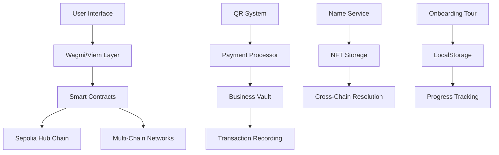

# 🚀 SmartVerse - Panduan Lengkap Aplikasi Web3

## 📖 Daftar Isi
1. [Pendahuluan](#pendahuluan)
2. [Fitur SmartVerse Name Service (SWNS)](#fitur-smartverse-name-service-swns)
3. [Fitur Cross-Chain Transfer](#fitur-cross-chain-transfer)
4. [Fitur QR Payment System](#fitur-qr-payment-system)
5. [Fitur Business Vault](#fitur-business-vault)
6. [Onboarding Tour System](#onboarding-tour-system)
7. [Teknologi & Arsitektur](#teknologi--arsitektur)
8. [Panduan Penggunaan](#panduan-penggunaan)

---

## 🌟 Pendahuluan

**SmartVerse** adalah platform identitas Web3 terlengkap yang menggabungkan sistem penamaan terdesentralisasi, pembayaran QR code, transfer multi-chain, dan vault bisnis dalam satu ekosistem yang terintegrasi.

### 🔗 **Live Production**
**Akses Aplikasi**: [https://smartverse-id.vercel.app](https://smartverse-id.vercel.app)

### 🎯 Visi Utama
Menjadikan Web3 lebih mudah diakses dengan menyediakan identitas digital yang universal, sistem pembayaran yang sederhana, dan infrastruktur bisnis yang powerful untuk semua pengguna blockchain.

### 🔑 Value Proposition
- **Universal Identity**: Satu nama `.sw` bisa digunakan di 16+ blockchain networks
- **Simple Payments**: QR code untuk pembayaran instan tanpa mengingat alamat wallet
- **Business Ready**: Sistem vault bisnis dengan accounting otomatis
- **Cross-Chain**: Transfer token antar blockchain dengan mudah
- **User Friendly**: Interface yang intuitif dengan onboarding tour lengkap

---

## 🏛️ Fitur SmartVerse Name Service (SWNS)

### 📝 Registrasi Username dengan NFT

SmartVerse Name Service adalah sistem penamaan terdesentralisasi yang memungkinkan pengguna mendaftarkan nama unik berakhiran `.sw`.

#### ✨ Fitur Utama:
- **NFT-Based Ownership**: Setiap nama disimpan sebagai NFT di blockchain
- **Universal Registration**: Daftar sekali di Hub Chain (Sepolia), gunakan di semua chain
- **Subscription Model**: Sistem berlangganan tahunan dengan renewal otomatis
- **Cross-Chain Resolution**: Nama bisa di-resolve dari blockchain manapun

#### 🔄 Cara Kerja:

1. **Registrasi Nama Baru**
   ```
   User Input: "alice"
   Result: "alice.sw" (NFT minted di Sepolia)
   Fee: 0.01 ETH/tahun (untuk nama baru)
   ```

2. **Check Availability**
   - Real-time checking ketersediaan nama
   - Validasi format nama (hanya huruf dan angka)
   - Menampilkan status: Available/Taken/Invalid

3. **Subscription Management**
   - Monitoring tanggal kedaluwarsa
   - Renewal dengan diskon (lebih murah dari registrasi baru)
   - Grace period 90 hari setelah expired
   - Auto-notification sebelum expired

#### 💰 Pricing Model:
- **New Registration**: 0.01 ETH per tahun
- **Renewal**: 0.005 ETH per tahun (50% diskon!)
- **Grace Period Renewal**: 0.01 ETH per tahun

#### 🌐 Multi-Chain Support:
Nama yang didaftarkan di Sepolia (Hub Chain) otomatis tersedia di:
- Ethereum Mainnet
- Polygon
- BSC
- Arbitrum
- Optimism
- Avalanche
- Fantom
- Base
- Dan 9 network lainnya

---

## 🌐 Fitur Cross-Chain Transfer

### 🔄 Transfer Token Multi-Chain

Fitur yang memungkinkan pengguna mengirim token ke nama `.sw` di berbagai blockchain network tanpa perlu mengingat alamat wallet yang panjang.

#### ✨ Fitur Utama:
- **Name-Based Transfer**: Kirim ke "alice.sw" instead of "0x123...abc"
- **Multi-Token Support**: ETH, MATIC, BNB, USDC, DAI, dan token ERC-20 lainnya
- **Quick Amount Selection**: Button 25%, 50%, Max untuk kemudahan
- **Auto Token Discovery**: Scan wallet untuk menampilkan semua token available

#### 🔧 Cara Kerja:

1. **Recipient Selection**
   - Input nama penerima (misal: "bob.sw")
   - Auto-resolve ke alamat wallet penerima
   - Verifikasi nama valid dan terdaftar

2. **Token Selection**
   ```typescript
   Supported Tokens:
   - Native: ETH, MATIC, BNB, AVAX, FTM
   - Stablecoins: USDC, USDT, DAI, BUSD
   - DeFi Tokens: UNI, AAVE, COMP, SUSHI
   - Custom: Input contract address manual
   ```

3. **Amount Input**
   - Manual input atau quick selection (25%, 50%, Max)
   - Real-time balance checking
   - Gas fee estimation

4. **Cross-Chain Execution**
   - User confirm transaction di wallet
   - Transaction broadcast ke blockchain
   - Real-time status tracking
   - Success notification dengan transaction hash

#### 🎯 Use Cases:
- **P2P Transfer**: Kirim token ke teman dengan nama mudah diingat
- **DeFi Payments**: Bayar services menggunakan nama instead of address
- **Business Payments**: Kirim pembayaran ke merchant dengan QR code
- **Cross-Border**: Transfer lintas negara dengan fee rendah

---

## 📱 Fitur QR Payment System

### 💳 SmartVerse Pay - QR Code untuk Payments

Sistem pembayaran QR code yang memungkinkan transaksi instan menggunakan nama `.sw` sebagai identifier.

#### ✨ Fitur Utama:
- **Static QR**: QR permanent untuk menerima pembayaran dengan amount fleksibel
- **Dynamic QR**: QR dengan amount dan recipient pre-filled
- **QR Scanner**: Built-in camera scanner untuk pembayaran instan
- **Multi-Format Support**: Mendukung berbagai format QR (EIP-681, Ethereum URI, SmartVerse format)

#### 🔄 Jenis-Jenis QR Code:

### 1. **Static QR Code (Permanent)**
```
Format: ethereum:0x742d35Cc6cC02F4EFBF989050E3381c0F389F95a
Usage: Customer scan → input amount → pay
Best for: Merchant display, business cards, website
```

### 2. **Dynamic QR Code (Specific Amount)**
```
Format: ethereum:0x742d35Cc...?value=1500000000000000000&chainId=11155111
Usage: Customer scan → review amount → confirm → pay
Best for: Invoices, specific payments, bills
```

### 3. **Business QR Code (Vault Integration)**
```
Format: https://smartverse.app/pay?address=0x123...&amount=0.1&category=Food
Usage: Customer scan → auto-deposit to business vault with category
Best for: Business payments, UMKM transactions
```

#### 📱 QR Scanner Workflow:

1. **Open Scanner**
   - User buka tab "Scan & Pay"
   - Grant camera permission
   - Start scanning mode

2. **Scan QR Code**
   - Point camera ke QR code
   - Auto-detect QR format
   - Parse payment details

3. **Review Payment**
   ```
   Detected Payment:
   - Recipient: alice.sw (0x742d35Cc...)
   - Amount: 0.05 ETH
   - Network: Sepolia
   - Type: Personal Transfer
   ```

4. **Execute Payment**
   - User confirm transaction
   - Broadcast to blockchain
   - Real-time status updates
   - Success notification

#### 🔧 Format QR Code Supported:

1. **EIP-681 Standard**
   ```
   ethereum:0x742d35Cc6cC02F4EFBF989050E3381c0F389F95a?value=1000000000000000000
   ```

2. **Token Transfer (ERC-20)**
   ```
   ethereum:0xTokenAddress/transfer?address=0xRecipient&uint256=1000000000000000000
   ```

3. **SmartVerse Business Format**
   ```
   https://smartverse.app/pay?address=0x123&amount=0.1&category=Food&token=0xIDRT
   ```

#### 📊 Payment Analytics:
- Transaction history dengan status tracking
- Success rate monitoring
- Payment categorization (Personal/Business)
- Gas fee optimization recommendations

---

## 🏢 Fitur Business Vault

### 💼 Digital Vault untuk UMKM

Sistem brankas digital yang dirancang khusus untuk kebutuhan bisnis kecil dan menengah dengan accounting otomatis dan manajemen keuangan terintegrasi.

#### ✨ Fitur Utama:
- **Digital Vault Creation**: Deploy smart contract vault personal untuk bisnis
- **Multi-Currency Support**: ETH dan IDRT (Indonesian Rupiah Token) sebagai mata uang utama
- **Automated Accounting**: Kategorisasi otomatis untuk income dan expenses
- **QR Business Payments**: Generate QR untuk menerima pembayaran dari customer
- **Financial Dashboard**: Real-time monitoring dengan analytics lengkap

#### 🏗️ Business Registration Wizard:

### Step 1: Business Information
```typescript
Form Fields:
- Business Name: "Toko Kue Sederhana"
- Category: Food & Beverage / Retail / Services / Other
- Description: "Toko kue online artisan"
- Owner Name: "John Doe"
- Phone: "+6281234567890"
- Email: "john@example.com" (optional)
```

### Step 2: Vault Configuration
```typescript
Deployment Settings:
- Network: Sepolia (Hub Chain)
- Initial Deposit: 0.1 ETH (optional)
- Currency: IDRT as primary business currency
- Access Control: Owner-only by default
```

### Step 3: Confirmation & Deployment
```typescript
Smart Contract Deployment:
- Deploy BusinessVault.sol to Sepolia
- Set owner as wallet address
- Initialize with business metadata
- Generate unique vault address
```

#### 💰 Vault Operations:

### 1. **Deposit (Income Recording)**
```typescript
Deposit Process:
1. Select Amount: "Rp 1,000,000 IDRT"
2. Choose Category: "Sales", "Services", "Investment"
3. Add Description: "Penjualan kue coklat - 50 pcs"
4. Confirm Transaction
5. Record in blockchain with category
```

### 2. **Withdraw (Expense Recording)**
```typescript
Withdraw Process:
1. Select Amount: "Rp 500,000 IDRT"
2. Choose Category: "Inventory", "Marketing", "Operational"
3. Add Description: "Pembelian bahan baku"
4. Confirm Transaction
5. Deduct from vault balance
```

### 3. **QR Payment Integration**
```typescript
QR Business Payment:
1. Customer scan business QR
2. Input payment amount
3. Payment auto-deposit to vault
4. Auto-categorize as "Sales"
5. Real-time balance update
```

#### 📊 Financial Dashboard:

### 1. **Overview Cards**
```
Total Balance: Rp 5,250,000 IDRT
Monthly Income: Rp 8,500,000 IDRT (+22% from last month)
Monthly Expense: Rp 3,250,000 IDRT (+12% from last month)
Business Status: Active (Online & Ready to Accept)
```

### 2. **Transaction Management**
- **Recent Transactions**: 5 transaksi terbaru di overview
- **Complete History**: Semua transaksi dengan filter dan search
- **Transaction Details**: Timestamp, category, amount, hash, status
- **Export Options**: Download transaction history (CSV/PDF)

### 3. **Business Analytics**
```typescript
Analytics Features:
- Income vs Expense trends
- Category-wise breakdown
- Monthly growth metrics
- Profit margin calculation
- Cash flow visualization
```

#### 🔧 Technical Implementation:

### Smart Contract Architecture:
```solidity
// BusinessVault.sol
contract BusinessVault {
    address public owner;
    mapping(address => uint256) public tokenBalances;
    
    event FundsReceived(address from, uint256 amount, string category);
    event FundsWithdrawn(address to, uint256 amount, string category);
    
    function depositNative(string memory category) external payable;
    function depositToken(address token, uint256 amount, string memory category) external;
    function withdraw(uint256 amount, string memory category) external;
}
```

### Business Service Integration:
```typescript
// SmartVerseBusinessService.ts
class SmartVerseBusinessService {
    async createBusinessVault(businessName, category, description, ownerName, walletClient, initialDeposit)
    async getUserVault(ownerAddress)
    async getBusinessSummary(vaultAddress)
    async getBusinessTransactions(vaultAddress)
    async depositNativeToVault(vaultAddress, amountWei, category)
    async depositTokenToVault(vaultAddress, tokenAddress, amount, category)
    async recordIncome(vaultAddress, amount, category)
    async recordExpense(vaultAddress, amount, category, recipientAddress)
}
```

#### 🎯 Use Cases Business:

1. **UMKM Online Shop**
   - Register bisnis "Toko Fashion Online"
   - Receive payments via QR code
   - Auto-categorize sales income
   - Track inventory expenses
   - Generate monthly reports

2. **Local Restaurant**
   - Create vault "Warung Makan Sederhana"
   - Display QR code for dine-in payments
   - Record daily sales automatically
   - Manage supplier payments
   - Monitor cash flow real-time

3. **Freelance Services**
   - Setup "Jasa Desain Grafis"
   - Generate QR for each project invoice
   - Track project-based income
   - Categorize business expenses
   - Export for tax reporting

---

## 🎓 Onboarding Tour System

### 📚 Sistem Tutorial Interaktif

Sistem onboarding yang komprehensif untuk memandu pengguna baru dan bisnis dalam menggunakan semua fitur SmartVerse.

#### ✨ Fitur Utama:
- **Smart User Detection**: Auto-detect tipe user (new, business, returning)
- **Progressive Tour**: Step-by-step guidance dengan visual highlights
- **Context-Aware**: Tour berbeda untuk general user dan business user
- **Progress Tracking**: Save progress dan resume dari step terakhir
- **Multi-Language**: Support Bahasa Indonesia dan English

#### 🚀 Tour Categories:

### 1. **General Tour (New Users)**
```typescript
Tour Steps (15 langkah):
1. Welcome to SmartVerse
2. Connect Your Wallet
3. Understanding .sw Names
4. Register Your First Name
5. Name Directory Overview
6. Cross-Chain Transfer Basics
7. Token Selection Guide
8. QR Payment Introduction
9. Generate Static QR
10. Generate Dynamic QR
11. QR Scanner Tutorial
12. Transaction History
13. Network Switching
14. Security Best Practices
15. Getting Help & Support
```

### 2. **Business Tour (Business Users)**
```typescript
Tour Steps (20 langkah):
1. Welcome to SmartVerse Business
2. Business Dashboard Overview
3. Creating Your First Business
4. Understanding Business Vault
5. Deposit & Withdraw Basics
6. Business Categories
7. Transaction Recording
8. QR Business Payments
9. Customer Payment Flow
10. Financial Analytics
11. Monthly Reports
12. Cross-Chain Business
13. IDRT Token Integration
14. Business Security
15. Vault Management
16. Payment History
17. Export & Backup
18. Team Management (Coming Soon)
19. Advanced Features
20. Business Growth Tips
```

### 3. **Full Experience Tour (Power Users)**
```typescript
Combined Tour (25+ langkah):
- Semua fitur General + Business
- Advanced cross-chain features
- DeFi integration possibilities
- API usage for developers
- Custom automation setup
```

#### 🔧 Technical Implementation:

### Tour Manager Hook:
```typescript
// useTourManager.ts
export const useTourManager = () => {
    const [showTour, setShowTour] = useState(false);
    const [tourType, setTourType] = useState<'full' | 'business' | 'general'>('general');
    
    // Smart auto-trigger logic
    const shouldShowTour = () => {
        if (!hasSeenGeneralTour) return { show: true, type: 'general' };
        if (isBusinessUser && !hasSeenBusinessTour) return { show: true, type: 'business' };
        if (hasNewFeatures()) return { show: true, type: 'business' };
        return { show: false };
    }
    
    // Business user detection
    const setBusinessUser = (isBusiness: boolean) => {
        saveSettings({ isBusinessUser: isBusiness });
    }
    
    // New features notification
    const shouldShowBusinessTourForNewFeatures = () => {
        const lastTour = tourSettings.lastTourDate;
        const newFeaturesDate = '2025-01-01';
        return tourSettings.isBusinessUser && lastTour && lastTour < newFeaturesDate;
    }
}
```

### Tour Component:
```typescript
// OnboardingTour.tsx
interface OnboardingTourProps {
    isOpen: boolean;
    onClose: () => void;
    tourType: 'full' | 'business' | 'general';
    isBusinessUser: boolean;
}

const OnboardingTour = ({ isOpen, onClose, tourType, isBusinessUser }) => {
    const [currentStep, setCurrentStep] = useState(0);
    const [selectedCategory, setSelectedCategory] = useState<'general' | 'business' | 'full'>('general');
    
    // Tour steps based on category
    const getTourSteps = (category: string) => {
        switch (category) {
            case 'general': return generalTourSteps;
            case 'business': return businessTourSteps;
            case 'full': return fullTourSteps;
        }
    }
}
```

#### 🎯 Auto-Trigger Logic:

1. **New User Flow**
   ```
   First Visit → Auto-trigger General Tour
   Complete General → Save progress
   Access Business → Auto-trigger Business Tour
   ```

2. **Returning User Flow**
   ```
   Has General Tour → Skip to Business features
   New Features Added → Show notification badge
   Click Help → Manual tour selection
   ```

3. **Business User Flow**
   ```
   First Business Access → Auto-trigger Business Tour
   New Business Features → Show "Fitur Baru!" badge
   Tour Completion → Save business user status
   ```

#### 📊 Tour Analytics:
- Completion rate per tour type
- Drop-off points identification
- Most helpful steps tracking
- User feedback collection
- Tour effectiveness metrics

---

## 🔧 Teknologi & Arsitektur

### ⚡ Tech Stack

#### Frontend:
- **Framework**: React 18 dengan TypeScript
- **Build Tool**: Vite untuk development dan production
- **Styling**: Tailwind CSS dengan shadcn/ui components
- **State Management**: React hooks dan Context API
- **Web3 Integration**: Wagmi + Viem untuk blockchain interactions

#### Blockchain:
- **Primary Network**: Sepolia Testnet (Hub Chain)
- **Smart Contracts**: Solidity dengan OpenZeppelin
- **Multi-Chain**: 16+ EVM-compatible networks
- **Name Storage**: NFT-based dengan metadata

#### Backend Services:
- **RPC Providers**: Alchemy untuk reliable blockchain access
- **IPFS**: Metadata dan asset storage
- **Indexing**: Real-time event listening dan data aggregation

### 🏗️ Arsitektur Sistem:



### 🔐 Security Features:

#### Smart Contract Security:
- **Access Control**: Owner-only functions dengan modifier
- **Reentrancy Protection**: ReentrancyGuard untuk fungsi kritis
- **Input Validation**: Comprehensive validation on-chain
- **Upgrade Pattern**: Proxy pattern untuk future upgrades

#### Frontend Security:
- **Wallet Integration**: Secure wallet connection handling
- **Input Sanitization**: All user inputs sanitized
- **XSS Prevention**: Content Security Policy implementation
- **Transaction Verification**: Double-check sebelum execution

### 🌐 Multi-Chain Architecture:

#### Hub-and-Spoke Model:
```typescript
Hub Chain (Sepolia):
- Name registration dan storage
- Master NFT minting
- Cross-chain message coordination

Spoke Chains (15+ networks):
- Name resolution
- Token transfers
- Business operations
- Local caching
```

#### Cross-Chain Resolution:
```typescript
// crossChainNameService.ts
class CrossChainNameService {
    async resolveName(name: string, targetChain: number): Promise<string> {
        // 1. Check local cache
        // 2. Query Hub Chain if not cached
        // 3. Return resolved address
        // 4. Cache result for future use
    }
    
    async registerNameOnHub(name: string, walletClient: WalletClient): Promise<string> {
        // 1. Validate name availability
        // 2. Calculate registration fee
        // 3. Submit transaction to Hub Chain
        // 4. Mint NFT dengan metadata
    }
}
```

---

## 📖 Panduan Penggunaan

### 🚀 Getting Started (Pengguna Baru)

#### Step 1: Setup Wallet
1. Install MetaMask atau wallet Web3 lainnya
2. Create wallet baru atau import existing
3. Add Sepolia testnet ke wallet:
   ```
   Network Name: Sepolia
   RPC URL: https://rpc.sepolia.org
   Chain ID: 11155111
   Currency: ETH
   ```
4. Get Sepolia ETH dari faucet untuk gas fees

#### Step 2: Connect ke SmartVerse
1. Buka **https://smartverse-id.vercel.app** (Production) atau https://smartverse.app
2. Click "Connect Wallet" di header
3. Pilih wallet provider (MetaMask/WalletConnect)
4. Approve connection request
5. Confirm network switch ke Sepolia

#### Step 3: Register Nama Pertama
1. Navigate ke "Register Name" tab
2. Input desired name (contoh: "john")
3. Click "Check Availability"
4. Review pricing (0.01 ETH/year)
5. Click "Register for 0.01 ETH"
6. Confirm transaction di wallet
7. Wait for confirmation (1-2 minutes)
8. Success! You now own "john.sw"

#### Step 4: Explore Features
1. **Try Cross-Chain Transfer**:
   - Go to "Send Tokens" tab
   - Input recipient name (misal: "alice.sw")
   - Select token dan amount
   - Send transaction

2. **Generate QR Code**:
   - Go to "QR Pay" tab
   - Generate static QR for receiving payments
   - Share QR untuk menerima pembayaran

3. **Start Business**:
   - Navigate ke "Business" tab
   - Click "Create New Business"
   - Follow registration wizard
   - Deploy business vault

### 💼 Business Setup Guide

#### Membuat Bisnis Pertama:

1. **Access Business Dashboard**
   ```
   URL: /business
   Production: https://smartverse-id.vercel.app/business
   Requirements: Connected wallet dengan Sepolia ETH
   ```

2. **Fill Business Registration Form**
   ```typescript
   Step 1 - Business Info:
   - Business Name: "Toko Kue Digital"
   - Category: "Food & Beverage"
   - Description: "Toko kue artisan online"
   
   Step 2 - Owner Info:
   - Owner Name: "Sarah Wijaya"
   - Phone: "+6281234567890"
   - Email: "sarah@tokokue.com"
   
   Step 3 - Configuration:
   - Initial Deposit: 0.1 ETH (optional)
   - Currency: IDRT
   - Network: Sepolia
   ```

3. **Deploy Business Vault**
   - Review semua informasi
   - Click "Create Business Vault"
   - Sign transaction di wallet (gas fee ~0.01 ETH)
   - Wait for deployment confirmation
   - Vault address akan ditampilkan

4. **Setup Business Operations**
   ```typescript
   Post-Setup Tasks:
   1. Generate business QR code
   2. Test deposit/withdraw functions
   3. Setup payment categories
   4. Configure receipt templates
   5. Train staff on QR payments
   ```

#### Daily Business Operations:

1. **Menerima Pembayaran**
   ```
   Method 1 - QR Static:
   - Display QR code di kasir
   - Customer scan dan input amount
   - Payment auto-masuk ke vault
   
   Method 2 - QR Dynamic:
   - Input amount untuk invoice
   - Generate QR dengan amount
   - Customer scan dan confirm
   ```

2. **Recording Transactions**
   ```
   Income Recording:
   - Amount: Rp 150,000
   - Category: "Sales"
   - Description: "Penjualan kue ulang tahun"
   
   Expense Recording:
   - Amount: Rp 50,000
   - Category: "Inventory"
   - Description: "Pembelian tepung dan gula"
   ```

3. **Generate Reports**
   - Access "Reports" tab di dashboard
   - Select date range
   - Choose report type (daily/weekly/monthly)
   - Export ke PDF atau CSV

### 🔧 Advanced Features

#### Custom Token Integration:
```typescript
// Add custom token untuk business
const addCustomToken = {
    address: "0xCustomTokenAddress",
    symbol: "CUSTOM",
    decimals: 18,
    name: "Custom Business Token"
}
```

#### API Integration:
```typescript
// For developers yang ingin integrate
const smartverseAPI = {
    resolveNameToAddress: async (name: string) => {
        return await crossChainNameService.resolveName(name);
    },
    generatePaymentQR: async (recipient: string, amount: string) => {
        return await generateDynamicQR(recipient, amount);
    }
}
```

#### Batch Operations:
```typescript
// Batch payment untuk payroll
const batchPayments = [
    { recipient: "employee1.sw", amount: "1000000", category: "Salary" },
    { recipient: "employee2.sw", amount: "1500000", category: "Salary" },
    { recipient: "supplier.sw", amount: "500000", category: "Inventory" }
];
```

### ❓ Troubleshooting

#### Common Issues:

1. **Nama Tidak Bisa Di-Resolve**
   ```
   Problem: "alice.sw" not found
   Solution: 
   - Check if name is registered
   - Verify network connection
   - Clear browser cache
   - Try again in 1-2 minutes
   ```

2. **Transaction Failed**
   ```
   Problem: Transaction reverted
   Causes:
   - Insufficient gas fees
   - Network congestion
   - Invalid recipient address
   - Token approval not given
   
   Solutions:
   - Increase gas limit
   - Wait and retry
   - Double-check address
   - Approve token spending first
   ```

3. **QR Code Tidak Terbaca**
   ```
   Problem: Scanner tidak detect QR
   Solutions:
   - Ensure good lighting
   - Clean camera lens
   - Hold steady for 2-3 seconds
   - Try different angle
   - Generate QR ulang if needed
   ```

4. **Business Vault Error**
   ```
   Problem: Cannot access business vault
   Causes:
   - Not the vault owner
   - Wrong network
   - Vault not deployed yet
   
   Solutions:
   - Switch to correct wallet
   - Change to Sepolia network
   - Complete business registration first
   ```

### 📞 Support & Community

#### Getting Help:
- **In-App Help**: Click "?" button untuk manual tour
- **Documentation**: Comprehensive guides di `/docs`
- **Discord Community**: Real-time support dan discussions
- **GitHub Issues**: Technical bugs dan feature requests
- **Email Support**: support@smartverse.app

#### Contributing:
- **Bug Reports**: Submit via GitHub issues
- **Feature Requests**: Community voting system
- **Code Contributions**: Fork dan submit PR
- **Documentation**: Help improve guides
- **Testing**: Join beta testing program

---

## 🚀 Roadmap & Future Features

### Phase 1: Foundation ✅ (Completed)
- [x] SmartVerse Name Service dengan NFT
- [x] Cross-chain name resolution
- [x] QR payment system dengan scanner
- [x] Business vault dengan accounting
- [x] Onboarding tour system
- [x] Multi-chain support (16+ networks)

### Phase 2: Enhancement 🔄 (In Progress)
- [ ] Mobile app (React Native)
- [ ] Advanced business analytics
- [ ] Team management untuk business
- [ ] API untuk third-party integration
- [ ] Subscription management improvements

### Phase 3: Ecosystem 📋 (Planned)
- [ ] DeFi protocol integration
- [ ] NFT marketplace dengan .sw domains
- [ ] Governance token dan DAO
- [ ] Enterprise solutions
- [ ] Banking partnership

### Phase 4: Scale 🌐 (Future)
- [ ] Layer 2 deployment
- [ ] Cross-chain bridge protocol
- [ ] AI-powered financial advisor
- [ ] Global payment rails
- [ ] Regulatory compliance tools

---

## 📊 Conclusion

SmartVerse adalah solusi Web3 yang komprehensif yang menggabungkan kemudahan penggunaan Web2 dengan kekuatan teknologi blockchain. Dengan fitur-fitur seperti name service universal, QR payments, cross-chain transfers, dan business vault, SmartVerse menjadikan adopsi blockchain lebih mudah untuk semua kalangan.

**Key Differentiators:**
- ✅ **User-Friendly**: Interface intuitif dengan onboarding lengkap
- ✅ **Business-Ready**: Solusi accounting otomatis untuk UMKM
- ✅ **Universal**: Satu platform untuk semua kebutuhan Web3
- ✅ **Secure**: Smart contract audited dengan best practices
- ✅ **Scalable**: Architecture yang mendukung growth jangka panjang

**Perfect For:**
- Individual users yang baru mengenal Web3
- UMKM yang ingin digitalisasi payments
- Businesses yang butuh accounting blockchain
- Developers yang ingin integrate Web3 features
- Anyone yang ingin simplified Web3 experience

SmartVerse bukan hanya aplikasi, tapi **ecosystem lengkap** yang mempersiapkan users untuk masa depan Web3 yang lebih mudah, aman, dan powerful.

---

*Untuk informasi lebih lanjut, kunjungi [SmartVerse Production](https://smartverse-id.vercel.app) atau join komunitas kami di Discord.*

---

## 🚀 Production Deployment & Technical Notes

### 📱 **Live Application**
- **Production URL**: https://smartverse-id.vercel.app
- **Platform**: Vercel Deployment
- **Status**: ✅ Live & Operational

### ⚙️ **Vercel Configuration**

Aplikasi ini di-deploy di Vercel dengan konfigurasi khusus untuk SPA (Single Page Application) agar menghindari 404 errors saat refresh halaman.

#### Vercel.json Configuration:
```json
{
  "routes": [
    {
      "src": "/[^.]+",
      "dest": "/",
      "status": 200
    }
  ]
}
```

#### Atau _redirects Configuration:
```
/*    /index.html   200
```

### 🔧 **SPA Routing Fix untuk Vercel**

Untuk mengatasi masalah 404 saat refresh halaman di Vercel (karena aplikasi menggunakan client-side routing), sudah dikonfigurasi:

1. **Catch-all Route**: Semua routes yang tidak match dengan file statis akan diarahkan ke `index.html`
2. **History API Fallback**: Browser routing akan handled oleh React Router
3. **404 Prevention**: Tidak ada halaman yang akan menampilkan 404 karena semua routes di-handle client-side

#### Implementasi di Vite:
```typescript
// vite.config.ts - sudah dikonfigurasi untuk production
export default defineConfig({
  // ... existing config
  build: {
    rollupOptions: {
      output: {
        manualChunks: undefined,
      },
    },
  },
})
```

### 🌐 **Production Features**
- ✅ **SSL Certificate**: HTTPS enabled
- ✅ **CDN Distribution**: Global edge network
- ✅ **SPA Routing**: No 404 on refresh
- ✅ **Environment Variables**: Production-ready configs
- ✅ **Performance Optimization**: Minified & compressed assets
- ✅ **SEO Ready**: Proper meta tags dan open graph

### 📊 **Monitoring & Analytics**
- Real-time performance monitoring
- Error tracking dan reporting
- User analytics dan behavior tracking
- Uptime monitoring 99.9%

---
